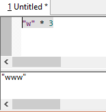
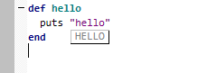
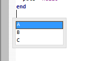

# SciTE-mruby

SciTE-mruby is a SciTE based text editor with mruby scripting extension.

[SciTE](http://www.scintilla.org/SciTE.html) is a cross-platform text editor written by Neil Hodgson.


## Features

- All [SciTE](http://www.scintilla.org/SciTE.html) features :)
- Extendable by a mruby script code like a Lua script
- Embedded [ExtMan](http://lua-users.org/wiki/SciteExtMan) rewritten in mruby
- Support to run mruby script without saving as a file (Alt+Ctrl+R key) 
- (**Not Yet**)Visual mruby script debugger

## Download 

(**Not Yet**)

## Install by mrbgems

#### 1. Download mruby

```
git clone https://github.com/mruby/mruby.git
```

#### 2. Add `conf.gem` line to `mruby/build_config.rb`

```ruby
MRuby::Build.new do |conf|

  # ... (snip) ...

  conf.gem 'mruby-eval'
  conf.gem :git => 'https://github.com/iij/mruby-io.git'
  conf.gem :git => 'https://github.com/iij/mruby-dir.git'
  conf.gem :git => 'https://github.com/iij/mruby-regexp-pcre.git' # or conf.gem :git => 'https://github.com/mattn/mruby-onig-regexp.git'
  conf.gem :git => 'https://github.com/sdottaka/mruby-bin-scite-mruby.git'
  conf.gem :git => 'https://github.com/mattn/mruby-require.git' # or conf.gem :git => 'https://github.com/iij/mruby-require.git'
end
```

#### 3. build

```
cd mruby
rake
```


## Differences with Lua API

|               | Lua      | mruby |
|---------------|----------|-------|
| `scite` object  | `scite`  | `SciTE` or `$scite` |
| `editor` object | `editor` | `Editor` or `$editor` |
| `output` object | `output` | `Output` or `$output` |
| scite/editor/output object method/property names | UpperCamelCase e.g.) `editor.GetText` | snake\_case or lowerCamelCase e.g.) `Editor.get_text` or `Editor.getText` |
| event handler | `OnOpen` ...  | `on_open` or `onOpen` |
| ExtMan event functions | `scite_OnOpen` | `SciTE.on_open(&block)` or `SciTE.onOpen(&block)` |
| ExtMan functions | `scite_Command` | `SciTE.command` or `SciTE.define_command(name, mode = nil, shortcut_key = nil, param = nil, &block)` |

## mruby script examples

### Add "Eval" menu item to [Tools] menu 

1. Click [Options] -> [Open mruby startup script]
2. Add the code below and save it



```ruby
SciTE.define_command "Eval selected text as mruby script", "*", "Ctrl+9" do 
  if Editor.selectionStart == Editor.selectionEnd
    p eval(Editor.getText)
  else
    p eval(Editor.getSelText)
  end
end
```

### Calltips




```ruby
SciTE.on_open_switch do |file|
  Editor.mouseDwellTime = 300
end

SciTE.on_dwell_start do |pos, word|
  if word != ""
    Editor.callTipShow pos, word.upcase 
  else
    Editor.callTipCancel
  end
end
```

### User list


```ruby
SciTE.define_command "Insert ABC", "*", "Ctrl+8" do 
  SciTE.userListShow ["A", "B", "C"] do |str|
    Editor.insertText Editor.currentPos, str
  end
end
```


### Others

See `examples` directory

# License

See `*_License.txt`

